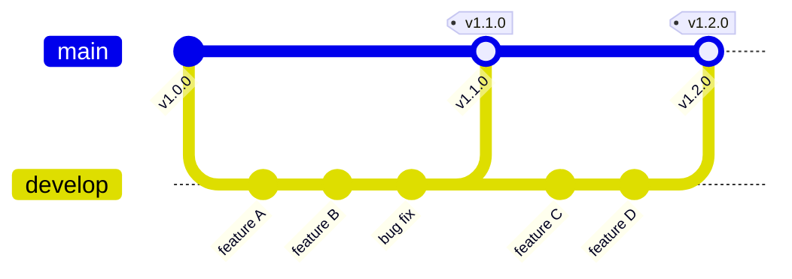

## Summary

This document defines the branching strategy used for FAIR project releases. 

## Core Principles

1. **Main is always production-ready** - The `main` branch represents the latest stable release
2. **Develoment occurs in primary development branch** - The `develop` branch is the development branch and is persistent
3. **Feature/Hotfix development branches** - Occurs in non-persistent branches
4. **Quality gates before merge** - All testing and validation happens before merging to main
5. **Automation supports humans** - CI/CD handles repetitive tasks; release managers shepherd the process

## Release Branch Workflow

### Workflow Steps

1. **Create Develop Branches**
   - Single time action as the `develop` branch is persistent.
   - Branch from `main` using the naming convention `develop`
   - Feature as the `feature/xxx` branch, branch from `develop`, deleted post-merge to `develop`
   - Hotfix as the `hotfix/xxx` branch, branch from `main`, deleted post-merge to `develop` and `main`
 
2. **Development Phase**
   - All feature work and bug fixes for the release go into the development branch
   - Updates within a release do **not** go directly into `main`
   - Contributors open PRs against the `develop` branch

3. **Testing & Validation**
   - QA and testing occur on the development branch
   - All CI checks must pass before the release is considered ready
   - Release manager coordinates validation efforts

4. **Merge to Main**
   - Once validated, the development branch is merged into `main` via PR
   - This triggers automated release actions and deployments
   - A version tag is created (e.g., `v1.2.0`)

5. **Cleanup**
   - Feature/Hotfix branches are deleted after successful merge
   - The cycle repeats for the next release

### Branch Lifecycle

## Branch Protection

### Main Branch

The `main` branch requires strict protection rules:

| Rule | Setting |
|------|---------|
| Require pull request reviews | 1-2 reviewers minimum |
| Require status checks to pass | All CI tests |
| Require code owner approval | Enabled |
| Prevent force pushes | Enabled |
| Prevent deletions | Enabled |
| Restrict direct pushes | Only via PR |

### Development or Feature/Hotfix Branches

Development branches (`develop`) should have these protections:

| Rule | Setting |
|------|---------|
| Require status checks to pass | All CI tests |
| Require pull request reviews | Recommended |
| Prevent force pushes | Enabled |
| Allow deletion | After merge to main |

## CODEOWNERS

A `CODEOWNERS` file should be placed in `.github/CODEOWNERS` to ensure appropriate review coverage.

## Automation

### GitHub Actions Workflow Structure

TBD

### Recommended Repository Settings

Enable these settings to support the workflow:

- **Require branches to be up to date** - Prevents merge conflicts in main
- **Require linear history** - Optional, keeps git history clean

## Quick Reference

### Branch Naming Convention

| Branch Type | Pattern | Example |
|-------------|---------|---------|
| Primary Branch | `main` | `main` |
| Development | `develop` | `develop` |
| Feature | `feature/description` | `feature/add-export` |
| Bugfix | `fix/description` | `fix/login-error` |
| Documentation | `docs/description` | `docs/api-guide` |
