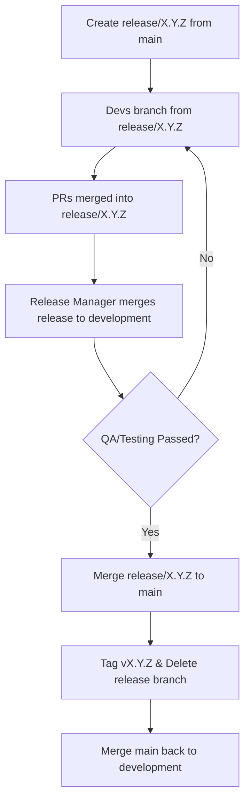

# Core Principles

* **Main is Production:** `main` only contains tagged, production-ready code.
* **Release Isolation:** Feature work is bundled into a specific `release/X.Y.Z` branch.
* **Development as Integration:** The `development` branch serves as the staging ground where the release is tested in a shared environment.
* **Gated Promotion:** Code moves from `release/X.Y.Z` → `development` (Testing) → `main` (Production).

# Release Branch Workflow

## Overview



## Workflow Steps

### 1. Create Release Branch

Branch from `main` using naming: `release/X.Y.Z`.

This ensures the release starts from a stable production state.

### 2. Development Phase

Developers create short-lived feature/fix branches from the release branch.

Pull Requests are opened against the **release branch**, not development or main.

Release Manager/Senior Devs review and merge these into the release branch.

### 3. Testing & Validation (The "Development" Gate)

The Release Manager merges the `release/X.Y.Z` branch into the `development` branch.

The `development` branch is deployed to the Staging/QA environment.

**Crucial:** If bugs are found, fixes are made on new branches off `release/X.Y.Z` and the process repeats.

### 4. Merge to Main

Once the release branch is verified on development, the Release Manager merges the release branch (not the `development` branch) into `main`.

This ensures only the specific, tested release code enters production.

A version tag (e.g., `v1.2.0`) is applied.

### 5. Cleanup & Sync

The release branch is deleted.

Main is merged back into development to ensure any hotfixes or version updates are synced for the next cycle.

## Branch Lifecycle

```
gitGraph
    commit id: "v1.0.0"
    branch development
    branch release/1.1.0
    checkout release/1.1.0
    commit id: "Feature A"
    commit id: "Feature B"
    checkout development
    merge release/1.1.0 id: "Testing on Staging"
    checkout release/1.1.0
    commit id: "Bugfix from QA"
    checkout development
    merge release/1.1.0 id: "Final Test"
    checkout main
    merge release/1.1.0 id: "v1.1.0 Production" tag: "v1.1.0"
    checkout development
    merge main id: "Sync Dev"
```

## Branch Protection Rules

+---------------|-------------|---------------|--------------+
| Branch        | PR Reviews  | Status Checks | Restrictions |
+---------------|-------------|---------------|--------------+
| `main`        | 2 Reviewers | Required      | Release Manager only. No direct pushes. |
| `development` | N/A         | Required      | Only accepts merges from release/* or main. |
| `release/*` |	1-2 Reviewers | Required      | Prevents force pushes. Source of truth for the next version. |

# Automation & Settings

* **Linear History:** Encouraged for main to keep the production log clean.
* **Target Branch Validation:** Use GitHub Actions to fail any PR that attempts to target main directly from a feature branch.
* **Auto-Sync:** Configure an action to merge `main` back into `development` whenever a release is tagged.
* **Auto Updates:** Configure an action to ensure the Changelog is updated.

## 1. Workflows

### Gatekeeper
Copy `[branch-gatekeeper.yml](./workflow/branch-gatekeeper.yml)` to the `.github/workflows/branch-gatekeeper.yml`.

It ensures that only the `release/` branches can target main or development.

### Auto-Tag & Sync Workflow

Copy `[post-release.yml](./workflow/post-release.yml)` to `.github/workflows/post-release.yml`.

This automates the "Cleanup & Sync" phase by tagging the release and updating the `development` branch once the Release Manager merges to `main`.

This will also update the `CHANGELOG.md` file.

## 2. Templates

Copy `[pull_request_template.md](./templates/pull_request_template.md)` to `.github/pull_request_template.md`.

Since `post-release.yml` uses commit messages to build the changelog, adopting **Conventional Commits** will help with properly documenting changes.

Naming PRs like this will create a "pretty print" changelog and group features and fixes together:

* `feat: add user profile editing`
* `fix: resolve memory leak in dashboard`
* `docs: update installation guide`

## 3. Repository Settings

Configure your GitHub settings:

1. **Go to Settings > Branches > Add Branch Protection Rule.**

2. **For `main` and `development`:**

Check **"Require status checks to pass before merging".**

Search for and select **"enforce-strategy"** (the name of the job in the YAML file).

This prevents the "Merge" button from being clickable if the Gatekeeper fails.

3. **For main only:**

Enable "Restrict pushes" to only allow Release Managers/Admins.

## 4. Changelogs

The updates to `CHANGELOG.md` are automated via **Post-Release Sync** workflow. This automation looks at the PR titles merged into the release branch and append them to the changelog before tagging.

### 2. How it works

1. **Extraction**: It pulls the version number directly from your `release/1.2.3` branch name.
2. **Log Generation**: It identifies every commit that happened since the last production release.
3. **Prepending**: It places the newest release at the **top** of the file (standard practice) rather than the bottom, so users don't have to scroll to see what's new.
4. **Verification**: Because this runs *after* the merge to `main`, the `CHANGELOG.md` update becomes part of the official `main` history and is immediately synced back to `development`.

### 3. Pro-Tip for Developers

For the changelog to look clean, encourage your team to use **descriptive PR titles**.

* Instead of: `fixed the bug`
* Use: `fix: resolved login timeout on mobile devices (#102)`

## 5. Summary

* Developers can only merge `feature/*` or `fix/*` into `release/*`.
* Release Managers are the only ones who can move `release/*` into `development` (for QA) and finally into `main`.
* Automation handles the tagging and making sure `development` doesn't fall behind `main`.

| Step | Action | Responsibility |
| :--- | :--- | :--- |
| **1. Kickoff** | Create `release/X.Y.Z` from `main`. | Release Manager |
| **2. Build** | Feature branches merge into `release/X.Y.Z`. | Developers & Senior Devs |
| **3. Test** | Merge `release/X.Y.Z` into `development`. | Release Manager |
| **4. Deploy** | Merge `release/X.Y.Z` into `main`. | Release Manager |
| **5. Cleanup** | Automation tags `vX.Y.Z`, updates **Changelog**, and syncs `development`. | **GitHub Actions** |


_Note: If the Auto-Sync fails due to a merge conflict, the Release Manager must manually resolve the conflict on the development branch to keep it in sync with main._
