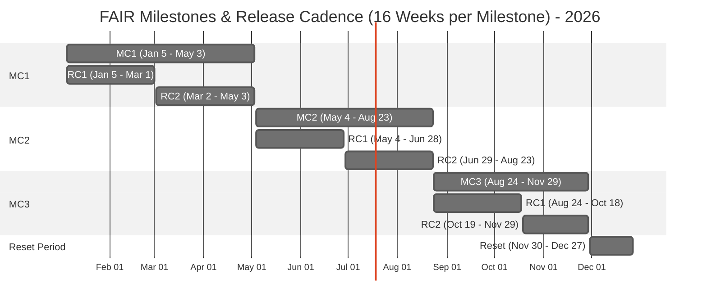
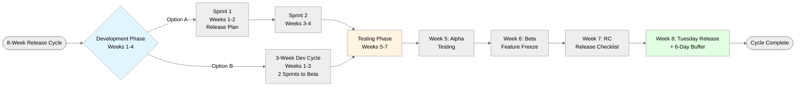

# Release Calendar

## Overview
The FAIR project follows a structured release cadence with three 16-week milestone cycles per year, followed by a 4-week reset period.

## Key Terms
- **MC** = Milestone Cycle (16 weeks each)
- **RC** = Release Cycle (8 weeks each, 2 per milestone)
- **Weeks** = ISO-8601 week numbers

## Structure
Each Milestone Cycle contains:
- Two 8-week Release Cycles
- Sprint phases: Development → Alpha → Beta (Feature Freeze) → RC → Release
- 6-day buffer after Tuesday releases

## FAIR Release Cycle - Sprint & Phase Structure (8 Weeks)

## 2026 Milestone Cycles

### MC1: January 5 - May 3 (ISO Weeks 2-18)
- **RC1**: January 5 - March 1 (Weeks 2-9)
- **RC2**: March 2 - May 3 (Weeks 10-18)

### MC2: May 4 - August 23 (ISO Weeks 19-34)
- **RC1**: May 4 - June 28 (Weeks 19-26)
- **RC2**: June 29 - August 23 (Weeks 27-34)

### MC3: August 24 - November 29 (ISO Weeks 35-48)
- **RC1**: August 24 - October 18 (Weeks 35-42)
- **RC2**: October 19 - November 29 (Weeks 43-48)

### Reset Period: November 30 - December 27 (ISO Weeks 49-52)
- 4-week break for planning, infrastructure updates, and team downtime
