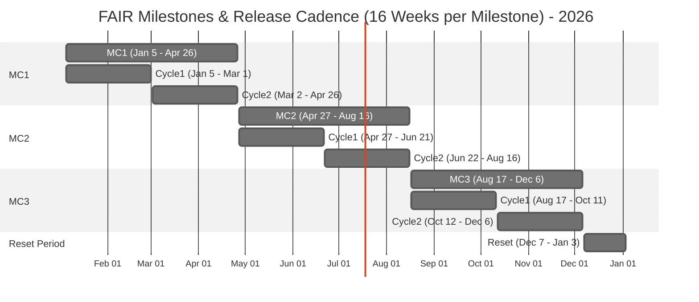

# Release Calendar

## Overview
The FAIR project follows a structured release cadence with three 16-week milestone cycles per year, followed by a 4-week reset period.

## Key Terms
- **MC** = Milestone Cycle (16 weeks each)
- **Cycle** = Release Cycle (8 weeks each, 2 per milestone)
- **Weeks** = ISO-8601 week numbers

## Structure
Each Milestone Cycle contains:
- Two 8-week Release Cycles
- Sprint phases: Development → Alpha → Beta (Feature Freeze) → Cycle → Release
- 6-day buffer after Tuesday releases

## FAIR Release Cycle - Sprint & Phase Structure (8 Weeks)

## 2026 Milestone Cycles

### MC1: January 5 - April 26 (ISO Weeks 2-17)
- **Cycle1**: January 5 - March 1 (Weeks 2-9)
- **Cycle2**: March 2 - April 26 (Weeks 10-17)

### MC2: April 27 - August 16 (ISO Weeks 18-33)
- **Cycle1**: April 27 - June 21 (Weeks 18-25)
- **Cycle2**: June 22 - August 16 (Weeks 26-33)

### MC3: August 17 - December 6 (ISO Weeks 34-49)
- **Cycle1**: August 17 - October 11 (Weeks 34-41)
- **Cycle2**: October 12 - December 6 (Weeks 42-49)

### Reset Period: December 7 - January 3, 2027 (ISO Weeks 50-53)
- 4-week break for planning, infrastructure updates, and team downtime

